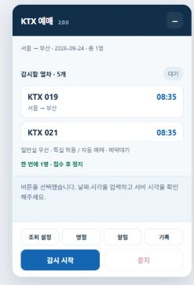
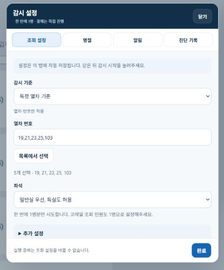
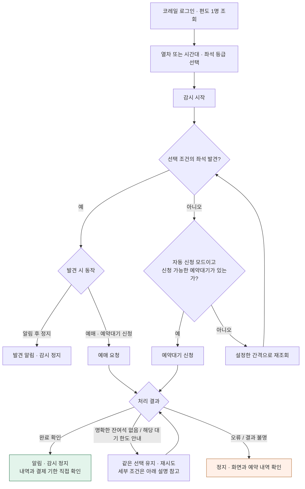
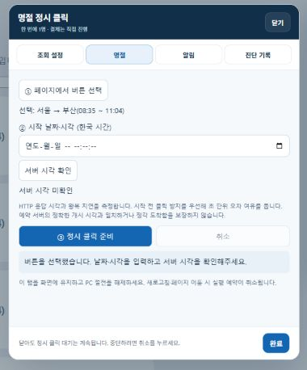
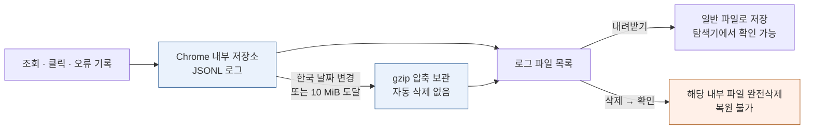

# KTX 잔여석 매크로

코레일 일반 예매 웹에서 원하는 KTX 좌석을 감시하고, 예매 또는 예약대기 신청을 보조하는 Chrome 확장 프로그램입니다. **한 번에 1명씩 접수하며, 결제는 직접 진행합니다.** 명절 페이지에서는 직접 선택한 버튼을 지정 시각에 한 번 누르는 별도 기능을 제공합니다.

현재 버전 **2.0.1** · [업데이트 내역](RELEASE_NOTES.md)

## 화면 구성

감시 패널에는 대상 열차와 진행 상태를 표시합니다. **조회 설정·명절·알림·기록**은 별도 팝업에서 열고, **감시 시작·중지**는 패널 하단의 같은 위치에 유지합니다.

| 감시 패널 | 설정 팝업 |
| --- | --- |
|  |  |

*실제 프로그램 UI를 사용한 샘플 화면입니다. 예약 결과를 나타내는 이미지는 아닙니다.*

- 같은 화면 크기에서는 새로고침·열차 수·상태 문구가 바뀌어도 패널 높이와 하단 버튼 위치가 유지됩니다.
- 작은 화면에서는 패널과 팝업이 화면 높이에 맞춰 줄어듭니다. 긴 목록·기록·설정 내용은 내부에서 스크롤하며, 팝업의 닫기·완료 버튼은 고정됩니다.
- 설정은 현재 탭에 자동 저장되어 새로고침 후에도 유지됩니다. **완료**는 팝업을 닫는 버튼이며 감시를 시작하지 않습니다. 감시 중 조회 설정을 바꾸려면 먼저 중지하세요.
- 팝업은 `Esc`로 닫을 수 있습니다. 탭 메뉴에서는 방향키·`Home`·`End`로 이동할 수 있습니다.

## 설치와 업데이트

1. 저장소 또는 배포 ZIP을 내려받아 압축을 풉니다.
2. Chrome의 `chrome://extensions`에서 **개발자 모드**를 켭니다.
3. **압축해제된 확장 프로그램 로드**를 누르고 `manifest.json`이 있는 폴더를 선택합니다.
4. 코레일 탭을 새로고침합니다.

업데이트할 때는 **감시 중지 → 기존 폴더 파일 교체 → 확장 프로그램 새로고침 → 코레일 탭 새로고침** 순서로 진행합니다.

사용에 Node.js·Python 등 별도 프로그램은 필요하지 않습니다. 자동 실행 중에는 코레일 탭의 Chrome 개발자 도구를 닫고, PC와 Chrome을 켜두세요. 절전·탭 종료·로그인 만료에 영향을 받습니다.

## 사용 방법

1. 코레일에 로그인하고 **편도·1명**으로 날짜와 구간을 지정해 조회합니다.
2. 패널의 **조회 설정**을 열어 **특정 열차** 또는 **시간대**를 선택합니다. 열차 번호는 여러 개 입력하거나 목록에서 고를 수 있습니다.
3. 좌석 등급과 좌석 발견 시 동작을 선택합니다. **완료**로 닫고 대상 열차를 확인한 뒤 **감시 시작**을 누릅니다.
4. 알림이 오면 코레일 예약 내역과 결제 기한을 확인하고 직접 결제합니다.

`−` 버튼으로 패널을 최소화해도 감시는 계속됩니다. 최소화된 패널에서도 중지할 수 있습니다.

감시·신청 흐름 그림으로 보기

| 설정 | 동작 |
| --- | --- |
| 특정 열차 | 선택한 열차 번호를 기준으로 감시합니다. 인접역 열차도 포함될 수 있습니다. 최초 목록과 더보기 최대 2회까지 찾습니다. |
| 시간대 | 조회 구간과 출발 시간대를 함께 확인합니다. 종료 시각을 포함하는 범위까지 더보기를 진행합니다. |
| 알림 후 정지 | 좌석 발견 시 알리고 정지합니다. 자동 신청하지 않습니다. |
| 예매 · 예약대기 신청 | 현재 읽은 목록의 좌석을 우선하고, 좌석이 없으면 조건에 맞는 예약대기를 신청합니다. |
| 추가 설정 | 조회 후 대기, 쉬어가기 등 조회 동작을 조정합니다. |

웹 조회 시작 시각보다 앞선 열차는 검사할 수 없습니다. 조회는 브라우저 일반 새로고침을 사용합니다.

### 예약대기와 다음 사람 신청

예약대기 접수 완료를 확인하면 정지하고 알립니다. **예약대기 접수는 좌석 확보가 아닙니다.** 이후 배정 여부와 결제 기한은 코레일에서 직접 확인하세요. 코레일의 선택 사항인 휴대폰 번호·개인정보 동의는 자동으로 켜지 않으며, 배정 이후의 상태도 감시하지 않습니다.

다른 1명을 신청하려면 기존 예약·예약대기 결과를 확인한 뒤 조회 화면에서 **기존 접수 유지하고 다음 1명 시작**을 누르세요. 확인창에 동의하면 현재 감시 조건으로 새 시도를 시작합니다. 기존 접수는 취소하거나 변경하지 않습니다. 같은 열차가 필요하면 해당 번호만 선택하세요.

결과가 불명확한 시도는 실제 내역을 먼저 확인해야 합니다. 코레일이 추가 신청을 거절하면 제한을 우회하지 않습니다.

### 안내창과 재시도

- 선택한 열차의 정차역·편성·지연·우회·단체 위약금 안내와 좌석 자동배정은 자동으로 확인·동의합니다. 지연 안내에는 지연배상이 없는 조건이 포함될 수 있습니다.
- 명확한 **잔여석 없음** 안내는 닫고 같은 선택을 유지해 예매만 재시도합니다.
- 예약대기 초기 신청에서 정확히 **예약대기자한도수초과** 안내가 나오면 같은 선택으로 재시도합니다. 새로고침하지 않고 응답과 안내창 종료를 기다리며 최소 1초 간격을 둡니다.
- 개인별 신청 제한·로그인·접근 제한·서버 오류·결과 불명·알 수 없는 안내는 자동 재시도하지 않습니다. 화면과 예약 내역을 직접 확인하세요.
- 조회 오류는 대기 시간을 늘려 복구를 시도합니다. HTTP 200 응답만으로 예약 성공을 판단하지 않습니다.

## 명절 정시 클릭 (시험 기능)

명절 예매 전체 과정을 자동으로 처리하는 기능이 아니라, **직접 선택한 버튼 하나를 지정 시각 이후에 한 번 누르는 기능**입니다. 로그인과 이후 예약 절차는 직접 진행하세요. 일반 잔여석 감시와 동시에 실행할 수 없습니다.

1. 코레일 페이지의 기존 패널에서 **명절**을 누릅니다. 설정 팝업의 **명절 탭**에서도 열 수 있습니다. 명절 전용 페이지에는 작은 패널이 자동으로 표시되며 **명절 설정**을 누르면 같은 방식의 팝업이 열립니다.
2. 팝업에서 **페이지에서 버튼 선택**을 누릅니다. 팝업이 잠시 닫히고 페이지에서 선택할 수 있습니다.
3. 버튼이나 링크 위에 마우스를 올리면 파란 네모 테두리가 표시됩니다. 클릭하면 대상으로 지정하며, **선택하는 동안 실제 버튼의 클릭·누름 동작은 차단**합니다. 선택을 마치거나 `Esc`로 취소하면 같은 팝업으로 돌아옵니다. iframe 내부와 Shadow DOM 내부 버튼은 지원하지 않습니다.
4. **한국 시간 기준 날짜·시각**을 입력하고 **서버 시각 확인**으로 측정 상태를 확인합니다.
5. **정시 클릭 준비**를 누릅니다. 서버 시각을 다시 측정하고 대기합니다. 시작 시각은 측정 오차 범위보다 최소 3초 이상 뒤여야 합니다. 준비가 끝나면 팝업이 닫히고 대기는 계속됩니다. 설정 팝업을 다시 열거나 닫아도 대기는 유지됩니다. **취소**를 눌러야 실행 예약이 취소됩니다.

### 서버 시각과 지연 처리

현재 페이지에 내용을 변경하지 않는 HEAD 요청을 보내 HTTP `Date`와 왕복 지연을 측정합니다. 3회 측정 중 왕복 지연이 가장 짧은 응답을 사용하며 대기 중에도 갱신합니다. 캐시된 응답(`Age > 0`), 실패 응답, 긴 지연, 불일치하는 시각과 만료된 측정값으로는 실행하지 않습니다. HEAD·Date를 지원하지 않는 페이지에서는 사용할 수 없습니다.

**지연시간만큼 미리 클릭하지 않습니다.** 응답 시각의 초 단위 오차와 왕복 지연을 고려한 범위에서, 가장 이른 추정 시각이 목표 시각을 지난 뒤에 클릭합니다. HTTP 시각의 반올림 오차를 위해 1초 여유와 시간 경과에 따른 여유를 적용하므로 정각보다 1~2초 이상 늦을 수 있습니다. HTTP `Date`는 메시지 생성 시각이며 실제 예약 판정 서버와 같다는 보장이 없습니다. **이 기능으로 조기 도착 방지나 밀리초 정밀한 예약 서버 도착을 절대 보장할 수는 없습니다.** [HTTP Date 명세](https://www.rfc-editor.org/rfc/rfc9110.html#section-6.6.1)

대기하는 탭을 화면에 유지하세요. 탭 숨김·새로고침·페이지 이동·절전이나 큰 타이머 지연·선택 버튼 변경 시 취소합니다. 버튼이 가려졌거나 비활성 상태면 클릭하지 않고 중단합니다. 클릭 결과가 불명확해도 자동으로 다시 누르지 않습니다. 선택 정보와 실행 예약은 현재 문서에만 유지되며 새로고침 후 다시 준비해야 합니다.

시각 측정, 대기 시작, 취소 사유, 클릭 결과는 기존 로그 파일에 `holiday-` 항목으로 기록됩니다. **실제 명절 예매 페이지의 서버 시각과 예매 동작은 아직 검증하지 않았습니다.** 실제 사용 전 해당 페이지에서 버튼 선택과 서버 시각 확인이 동작하는지 확인하세요.

## 알림 연결

**PC 알림:** 패널의 **알림 → 소리·PC 알림 테스트**에서 테스트합니다. Chrome 알림 허용 및 운영체제의 집중 모드를 확인하세요.

**휴대폰 알림:** **알림 → 휴대폰 알림 연결 · ntfy**를 엽니다.

1. 휴대폰에 [ntfy 앱](https://docs.ntfy.sh/subscribe/phone/)을 설치하고 알림을 허용합니다.
2. 서버 `https://ntfy.sh`와 연결 화면의 주제 이름으로 구독합니다.
3. PC에서 휴대폰 알림 사용을 켜고 저장한 뒤 테스트 알림을 보냅니다.

ntfy 연결 권한은 켤 때만 요청합니다. 주제 이름을 아는 사람은 알림을 읽거나 보낼 수 있으므로 공유하지 마세요. 열차 번호·출발일·구간·출발시각·좌석 등급·처리 결과·재시도 횟수와 분류된 중지 사유를 전송합니다. 예약번호·계정 정보·쿠키·오류 원문은 보내지 않습니다. 서버 전송 성공과 휴대폰 수신은 별도로 확인해야 합니다.

## 로그 확인과 삭제

**기록 → 진단 기록 → 로그 파일 · 내려받기**에서 로그 파일을 확인하고 내려받습니다. 오류가 발생하면 해당 시각의 파일을 진단에 사용할 수 있습니다. 로그에는 진행 단계·클릭 상태·안내창·중지 이유 등이 남지만, 모든 오류를 자동 해결하거나 서버 내부 원인을 확인할 수 있는 것은 아닙니다.

- 로그는 **Chrome이 관리하는 PC 내부 저장소(OPFS)**에 보관됩니다. 표시된 파일명으로 탐색기나 Everything에서 바로 찾을 수 없으며, 내려받으면 일반 파일로 저장됩니다.
- 한국 날짜가 바뀌거나 파일이 **10 MiB**에 도달하면 gzip으로 압축합니다. 브라우저가 꺼져 있으면 다음 실행 때 처리합니다. 압축본은 자동 삭제하지 않습니다.
- 내려받기 옆 **삭제**를 누르고 확인하면 해당 파일을 **완전삭제**합니다. 휴지통으로 이동하지 않으며 복원할 수 없습니다. 이미 내려받은 파일에는 영향을 주지 않습니다.
- 기록 중인 파일을 삭제해도 이후 기록은 새 파일에 저장됩니다. 패널의 최근 기록과 `lastError`는 별도 탭 세션 데이터입니다.
- 확장 프로그램 제거·저장 데이터 초기화 시 내부 로그도 삭제됩니다. 강제 종료 직전 전달되지 않은 기록은 누락될 수 있습니다.
- URL·이메일·일반적인 전화번호·예약번호 표기는 가리지만 모든 개인정보 형식을 보장하지 않습니다. 외부 공유 전 내용을 확인하세요. 쿠키·요청/응답 본문·전체 페이지 HTML은 수집하지 않습니다.

## 권한과 데이터

| 권한 | 용도 |
| --- | --- |
| `debugger` | 버튼 위치와 상태를 확인한 뒤 브라우저 마우스 입력 수행 |
| `notifications` | PC 알림 |
| `storage` | 휴대폰 알림 설정 보관 |
| `alarms` | 오래된 로그의 주기적 압축 |
| `activeTab` | 확장 프로그램 아이콘에서도 현재 코레일 탭의 설정 팝업 열기 |
| `https://ntfy.sh/*` (선택) | 사용자가 켠 휴대폰 알림 전송 |

명절 설정 패널은 HTTPS `korail.com` 및 하위 도메인에 자동 표시됩니다. 업데이트 시 Chrome에서 이 사이트 범위의 접근 권한을 확인할 수 있습니다. 일반 잔여석 감시 스크립트의 대상은 기존 `/ticket/` 페이지로 유지합니다.

감시 조건·실행 상태·현재 시도 기록은 탭의 세션 저장소에, ntfy 설정은 확장 프로그램의 로컬 저장소에 보관합니다. 다른 PC로 자동 동기화하지 않습니다.

## 개발과 검증 범위

개발용 테스트는 Node.js 환경에서 `npm test`로 실행합니다. 일반 사용에는 Node.js가 필요하지 않습니다.

Chrome 화면과 모의 테스트로 일부 동작을 검증했습니다. 실제 매진 경쟁 상황의 좌석 확보, 추가 1명 접수, 모든 예약 화면 형식은 보장하지 않습니다. 로그 삭제는 Windows·Mac Chrome 공통 API로 구현했지만 두 OS의 실제 브라우저에서 모두 검증한 것은 아닙니다. 버전별 변경과 검증 내역은 [릴리스 노트](RELEASE_NOTES.md)를 참고하세요.
